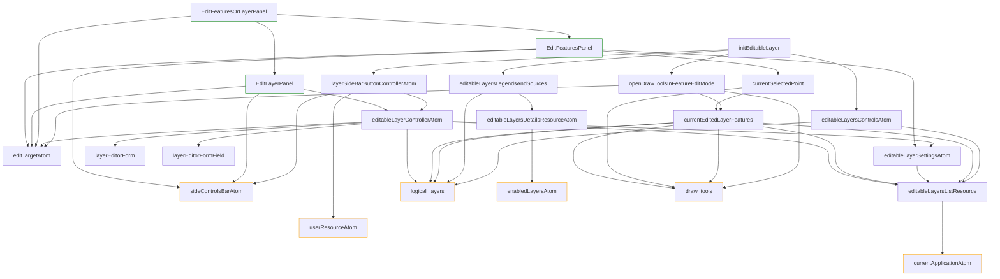

# Create Layer Feature

Feature flag name: `create_layer`

## Short feature purpose description:

Allows the authorized user to create and edit his own layers with geojson source,
and edit features properties

Consists of two parts:

1. Create / Edit Layer properties
   This part allow change such properties like layer name,
   and properties files inside features.

2. Create / Edit layer features properties
   This part allow you to add/remove/move new features in layers,
   and edit properties for every feature.

## How to use

You must call the `initEditableLayer` from the root `index.ts` file to activate the feature,
and place `<LayerEditorPanel />` somewhere in the app

```ts
import {
  initEditableLayer,
  EditFeaturesOrLayerPanel,
} from '~features/create_layer';

function App() {
  useEffect(() => {
    initEditableLayer();
  }, []);

  return <EditFeaturesOrLayerPanel />;
}
```

## Requirements

This feature use next core modules:

- logical_layers
- draw_tools
- currentApplicationAtom
- userResourceAtom
- notificationsService
- translationService
- side_bar
- apiClient

*

## How it work

1. layerSideBarButtonControllerAtom add "Create layer" button in side bar (layerSideBarButtonControllerAtom). This button create new layer on click.
2. editableLayersListResource atom load enabled user layers
3. editableLayersControlsAtom - create logical_layer (visible in layers panel) for every layer from editableLayersListResource
4. editableLayersLegendsAndSources - create legends and sources for enabled layers
5. editTarget - contain if of layer that user edit and info about what part of layer edited right now - layer info or layer features
   Depending on editTarget state <EditFeaturesOrLayerPanel /> show layer dit form, or feature edit form, or nothing if layer not selected.
6. openDrawToolsInFeatureEditMode activate draw tools when editTarget point to edit feature state
7. editableLayerSettingsAtom contain settings of custom fields in features properties. Used for form.
8. currentSelectedPoint handle updates of selected features,
   while currentEditedLayerFeatures contain all features of current layer
9. editableLayerControllerAtom create, delete and handle updates of while layer

### Interaction with the core

In the initialization process this feature add


